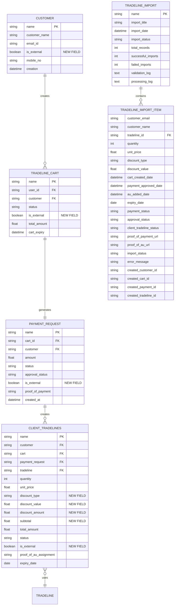
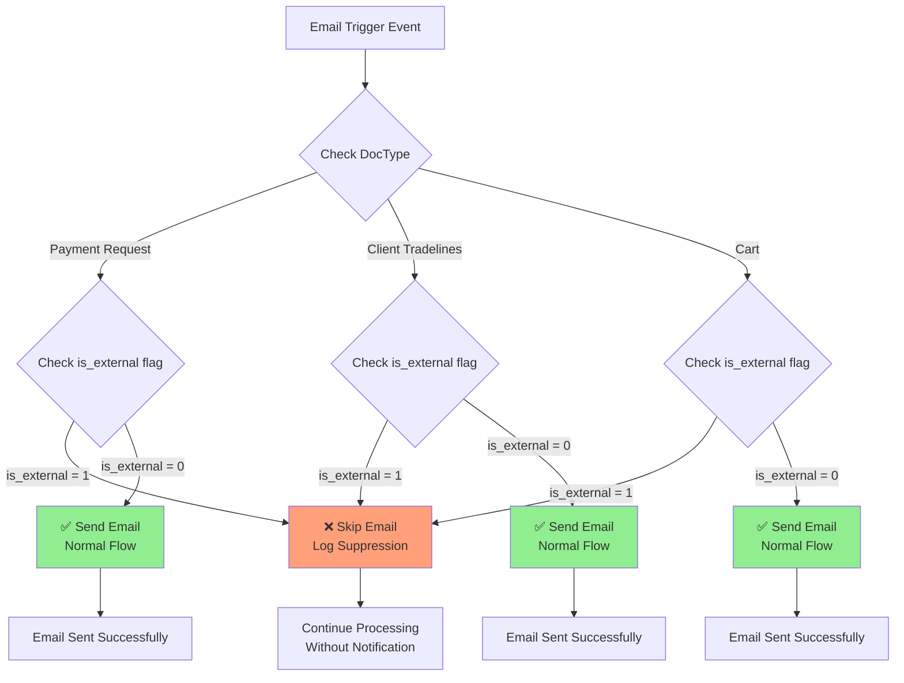
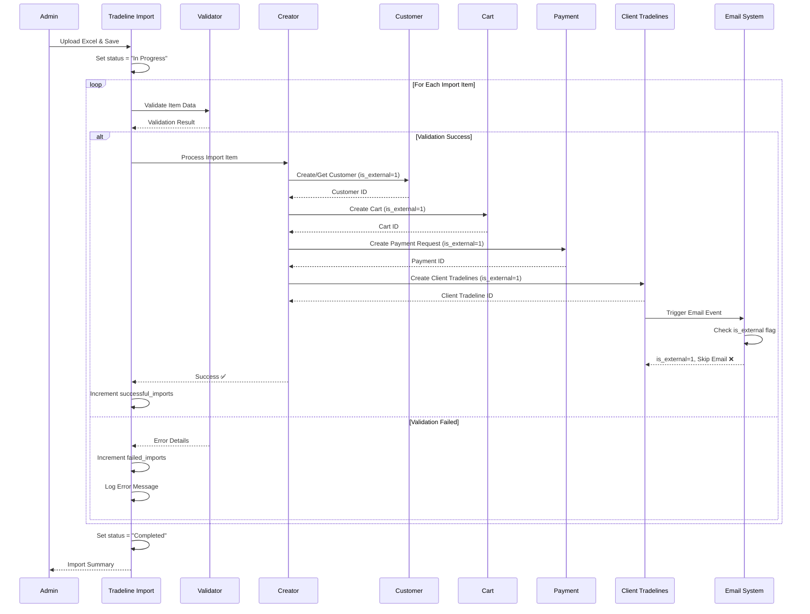
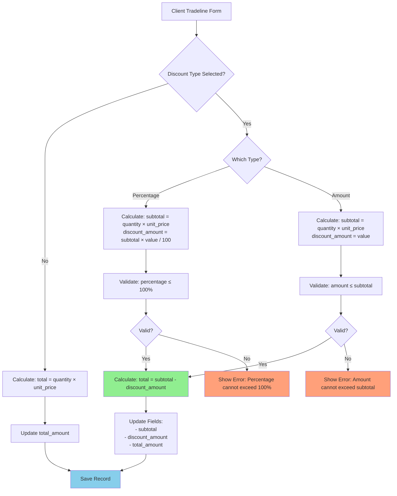
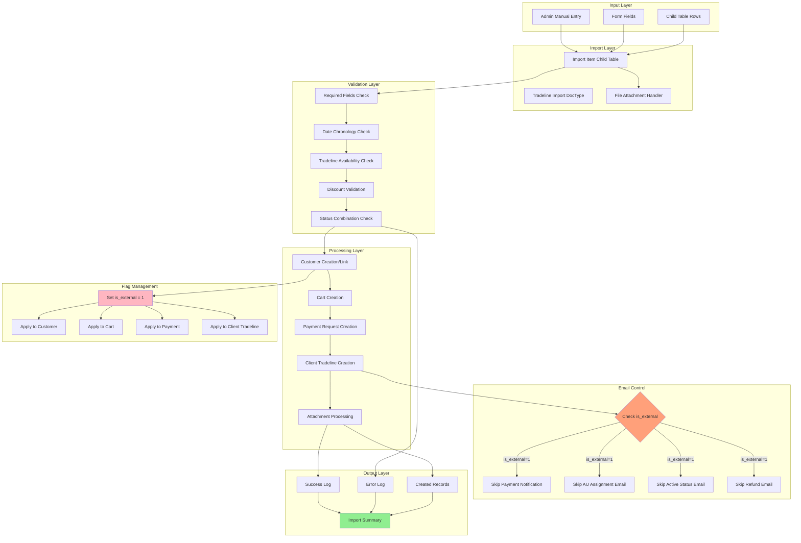
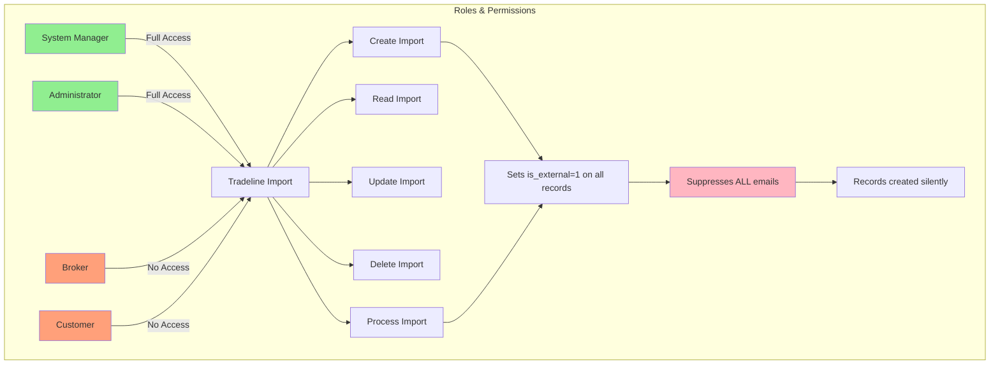
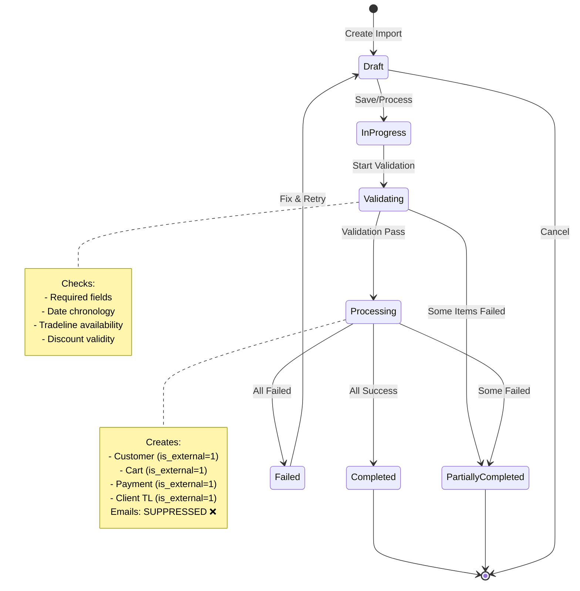
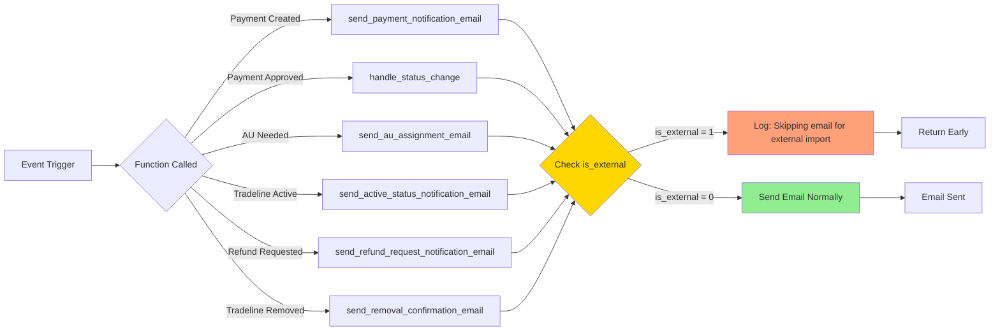

# Tradeline Import System - Visual Diagrams

## 🎯 is_external Flag Implementation

### Overview Diagram

```mermaid
graph TB
    subgraph "Normal Purchase Flow"
        A1[Customer Creates Cart] --> A2[Adds Items]
        A2 --> A3[Checkout]
        A3 --> A4[Upload Payment Proof]
        A4 --> A5[Payment Request Created<br/>is_external = 0]
        A5 --> A6{Admin Approves?}
        A6 -->|Yes| A7[Client Tradeline Created<br/>is_external = 0]
        A7 --> A8[📧 Send AU Request Email]
        A8 --> A9[Upload AU Proof]
        A9 --> A10[Status = Active]
        A10 --> A11[📧 Send Active Email]
    end
    
    subgraph "Manual Import Flow"
        B1[Admin Creates Import] --> B2[Add Items One by One]
        B2 --> B3[Fill All Fields Manually]
        B3 --> B4[Submit Form]
        B4 --> B5[Validate Data]
        B5 --> B6{Valid?}
        B6 -->|Yes| B7[Create Customer<br/>is_external = 1]
        B7 --> B8[Create Cart<br/>is_external = 1]
        B8 --> B9[Create Payment Request<br/>is_external = 1]
        B9 --> B10[Create Client Tradeline<br/>is_external = 1]
        B10 --> B11{Check is_external}
        B11 -->|TRUE| B12[❌ Skip ALL Emails]
        B12 --> B13[Records Created Silently]
        B6 -->|No| B14[Log Error]
    end
    
    style A5 fill:#90EE90
    style A7 fill:#90EE90
    style B7 fill:#FFB6C1
    style B8 fill:#FFB6C1
    style B9 fill:#FFB6C1
    style B10 fill:#FFB6C1
    style A8 fill:#87CEEB
    style A11 fill:#87CEEB
    style B12 fill:#FFA07A
```



---

## 📊 Data Model Changes

### DocType Modifications



---

## 🔄 Email Suppression Flow

### Decision Tree



---

## 📋 Import Processing Workflow

### Step-by-Step Process



---

## 🔍 Discount Implementation Diagram

### Discount Calculation Flow



---

## 🚀 Complete Import Architecture

### System Overview



---

## 🎨 DocType Field Layout

### Tradeline Import DocType UI

```
┌─────────────────────────────────────────────────────────────────┐
│ Tradeline Import                          [IMP-00001] [Draft]   │
├─────────────────────────────────────────────────────────────────┤
│                                                                  │
│  Import Title: Historical Purchase Import - October 2025_____  │
│  Import Date:  [2025-10-12 14:30:00]  Status: [Draft ▼]        │
│  Import Notes: Importing 3 historical purchases from legacy___ │
│                system for customer migration___________________  │
│                                                                  │
├─────────────────────────────────────────────────────────────────┤
│ Import Items                                          [+ Add Row]│
├─────────────────────────────────────────────────────────────────┤
│ Row 1:                                                           │
│  Customer Email*:  john@example.com_________________________    │
│  Customer Name*:   John Doe_________________________________    │
│  Tradeline*:       [TL-0001 ▼] Chase Bank - $15,000            │
│  Quantity*:        [2]      Unit Price*: [$150.00]              │
│  Cart Created*:    [2025-01-15 10:30:00]                        │
│  Payment Approved*:[2025-01-16 14:20:00]                        │
│  Payment Status*:  [Completed ▼]  Approval*: [Approved ▼]      │
│  Client Status*:   [Active ▼]                                   │
│  Discount Type:    [Percentage ▼]  Value: [10]                 │
│  Import Status:    [Pending]                                    │
│ ─────────────────────────────────────────────────────────────   │
│ Row 2:                                                           │
│  Customer Email*:  jane@example.com_________________________    │
│  Customer Name*:   Jane Smith_______________________________    │
│  Tradeline*:       [TL-0002 ▼] Bank of America - $20,000       │
│  Quantity*:        [1]      Unit Price*: [$200.00]              │
│  ...                                                             │
│                                                                  │
├─────────────────────────────────────────────────────────────────┤
│ Import Summary (After Submit)                                   │
├─────────────────────────────────────────────────────────────────┤
│  Total Records:     [3]          Successful: [3]                │
│  Failed Imports:    [0]                                         │
│                                                                  │
│  Validation Log:                                                 │
│  ┌──────────────────────────────────────────────────────────┐  │
│  │ ✓ Row 1: john@example.com - Valid                       │  │
│  │ ✓ Row 2: jane@example.com - Valid                       │  │
│  │ ✓ Row 3: bob@example.com - Valid                        │  │
│  └──────────────────────────────────────────────────────────┘  │
│                                                                  │
│  Processing Log:                                                 │
│  ┌──────────────────────────────────────────────────────────┐  │
│  │ [14:30:01] Created customer: CUST-00001                  │  │
│  │ [14:30:02] Created cart: CART-0001                       │  │
│  │ [14:30:03] Created payment: PAY-CART-0001-IMPORT         │  │
│  │ [14:30:04] Created client tradeline: CTL-00001           │  │
│  │ [14:30:05] Skipped email (external import)               │  │
│  └──────────────────────────────────────────────────────────┘  │
│                                                                  │
├─────────────────────────────────────────────────────────────────┤
│ Settings                                                         │
├─────────────────────────────────────────────────────────────────┤
│  [☑] Suppress Emails (Always enabled for imports)              │
│                                                                  │
│  [Save]  [Submit]  [Cancel]                                     │
│                                                                  │
└─────────────────────────────────────────────────────────────────┘

Note: Submit button triggers import processing
      Save keeps as Draft for further editing
```

---

## 🔐 Security & Access Control

### Permission Matrix



---

## 📊 Import Status States

### State Machine



---

## 🎯 Modified Email Functions

### Function Call Flow with is_external Check



---

*This diagram document complements TRADELINE_IMPORT_README.md*  
*Last Updated: October 12, 2025*
