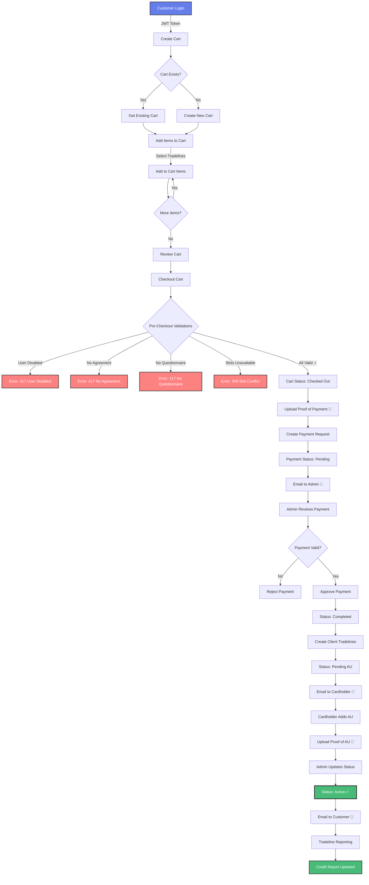
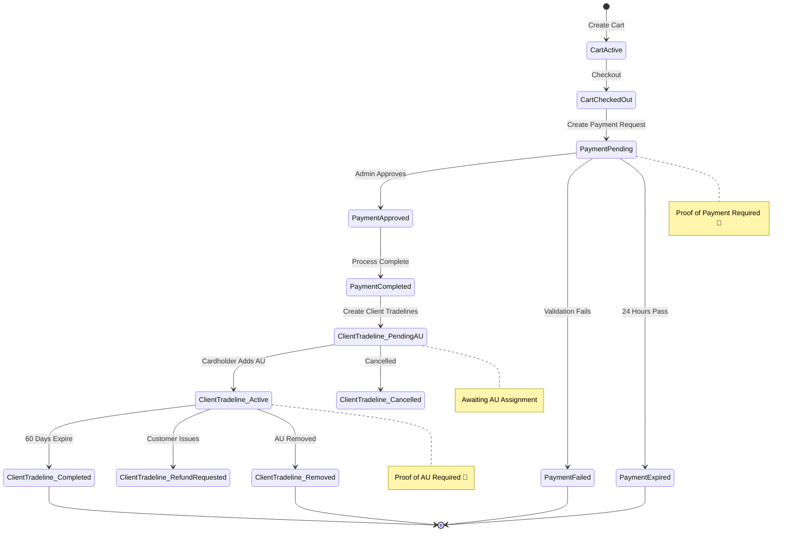
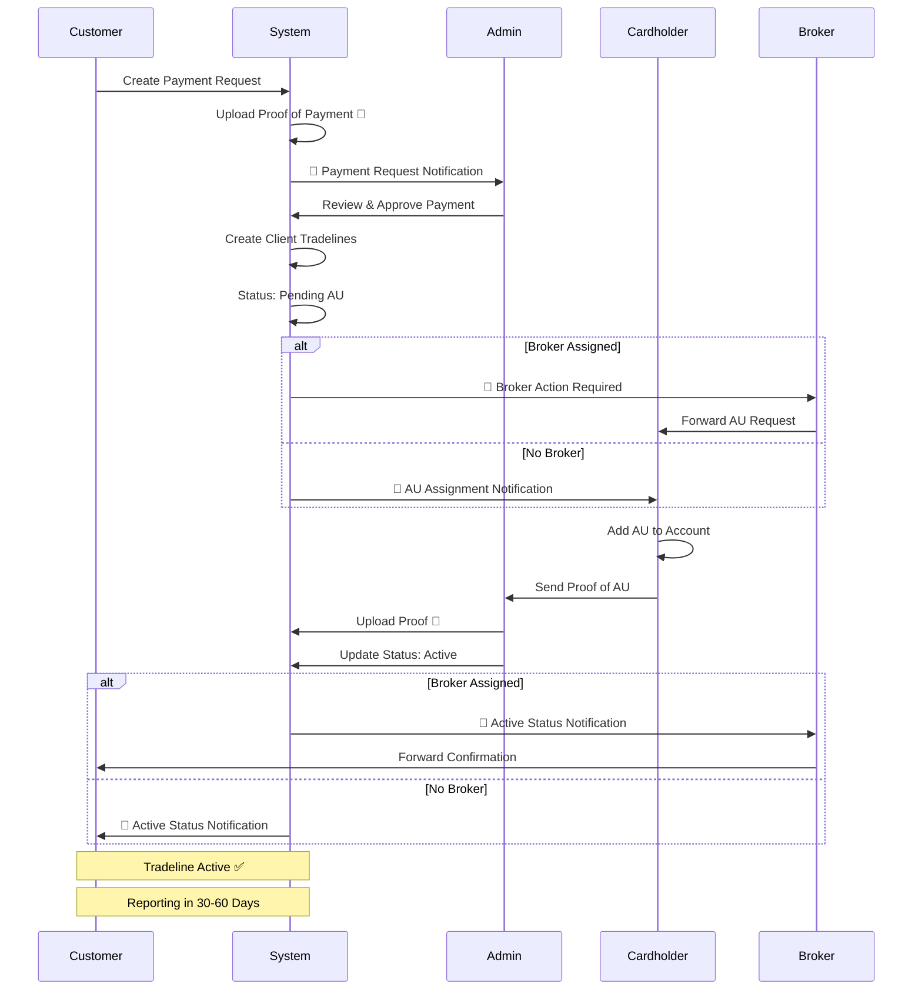
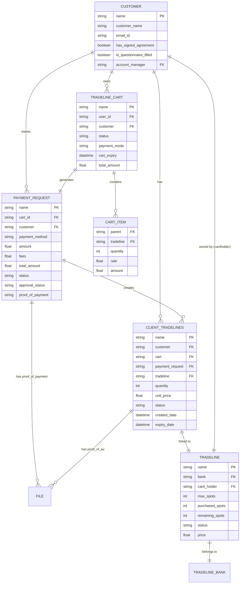
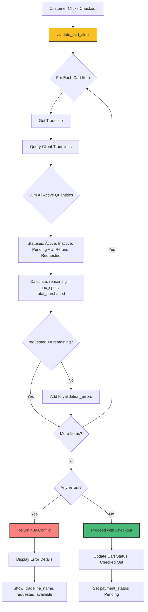
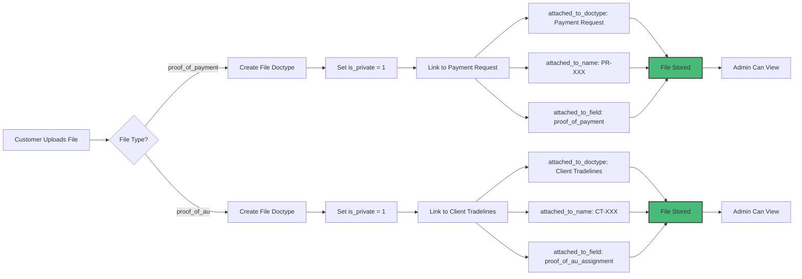
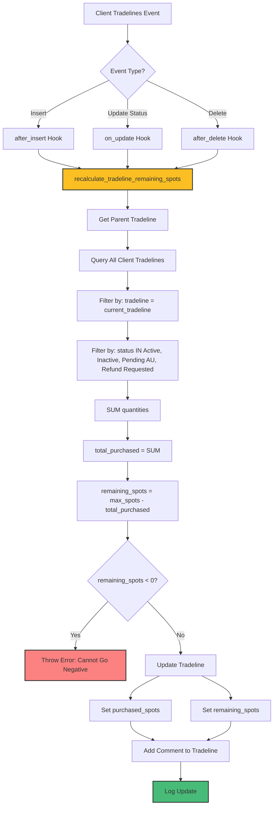
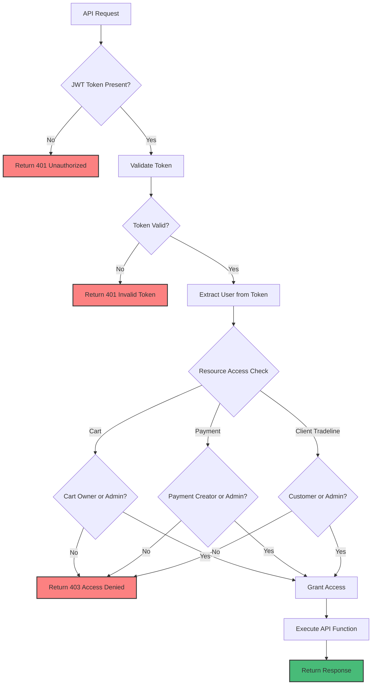
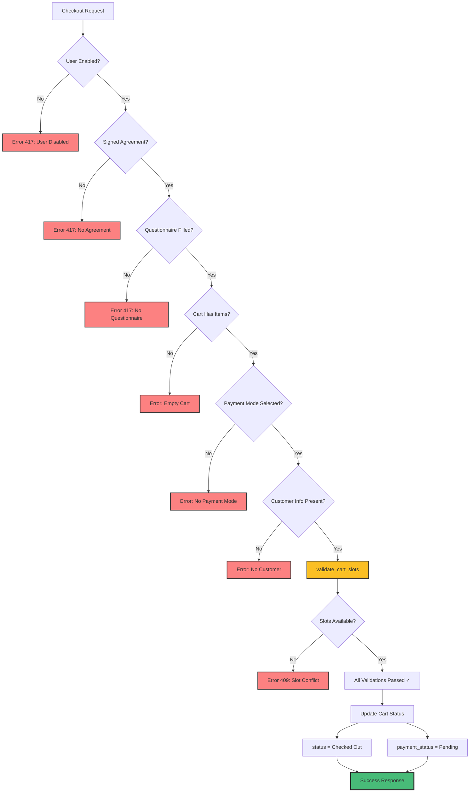
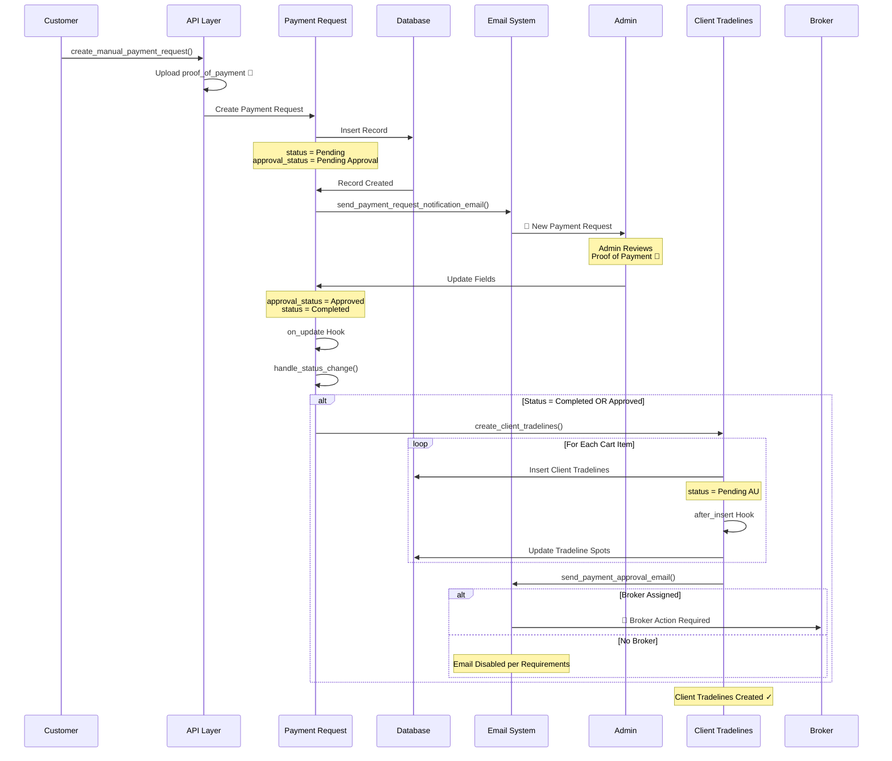

# RocketTradeLine - Mermaid Flow Diagrams

## Complete Purchase Flow

---

## Status Transitions

---

## Email Notification Flow

---

## Data Relationship Diagram

---

## Slot Availability Check Flow

---

## File Attachment Flow

---

## Tradeline Spot Recalculation

---

## API Security Flow

---

## Checkout Validation Flow

---

## Payment Approval Workflow

---

*These diagrams can be rendered using Mermaid-compatible tools like:*
- *GitHub Markdown*
- *Mermaid Live Editor (mermaid.live)*
- *VS Code with Mermaid extension*
- *Confluence, Notion, GitLab*
